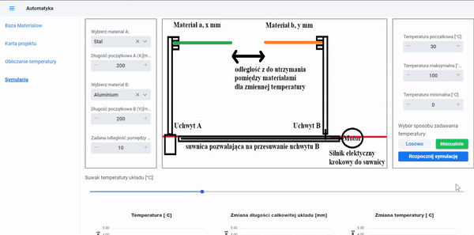
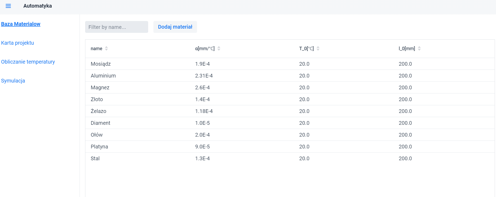

# Linear expansion of materials website 

## About project

- Small university project in the field of automation (but if you found something cool inside feel free to contact us)
- Made with Spring, Vaadin and Java.
- Effect of the first time rendez vouz with Spring framework.
- Contains small database of materials (CRUD operations included).

# Idea description

### Main app purpose
Kind of a abstract experimental workspace for theoretical problem of materials linear expansion where in every iteration temperature changes randomly/manually. Then virtual PID controller make workspace react for every change which you can watch live on the plots.

### Additional purpose
In addition, there is also a mini-content that calculates the temperature that would theoretically have to be reached in order to properly lengthen a rod made of the selected material.

## Important note
Physical and mathematical simplified model description is in the pdf file 'kartaprojektu' (polish language only) and may contain some small logical errors for which we apologise.
